# School District Analysis
## Overview
The purpose of this analysis was to assist Maria to prepare all standardized test data for analysis, reporting, and presentation to provide insights on performance trends and patterns. In this analysis, we are looking into student funding and student standardized test scores.
Due to academic dishonesty, we will additionally be looking at the effects of removing a certian group from our dataset, to maintain state-testing standards.
## Results
### District Level
Variations on the district level as a whole, post data adjustment:
* Average math scores decreased by 0.1%
* Percentage of students passing math decreased by 0.2%
* Percentage of students passing reading decreased by 0.1%
* Percentage of students passing overall decreased by 0.3%
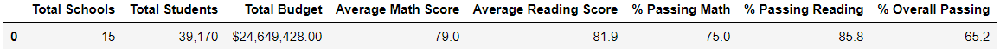
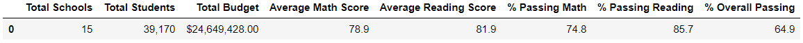
(For Reference, The upper table displays our data, pre-adjustment, while the lower table displays our data post-adjustment)
### School Level
As a note, the group removed from our dataset was ninth graders from Thomas High School, hence why we are covering specifically them.
Variations on the school level as a whole, post data adjustment:
* Thomas High School saw a decrease of 0.087% students passing math
* Thomas High School saw a decrease of 0.29% students passing reading
* Thomas High School saw a decrease of 0.318% students passing both overall
* all other schools remain unchanged

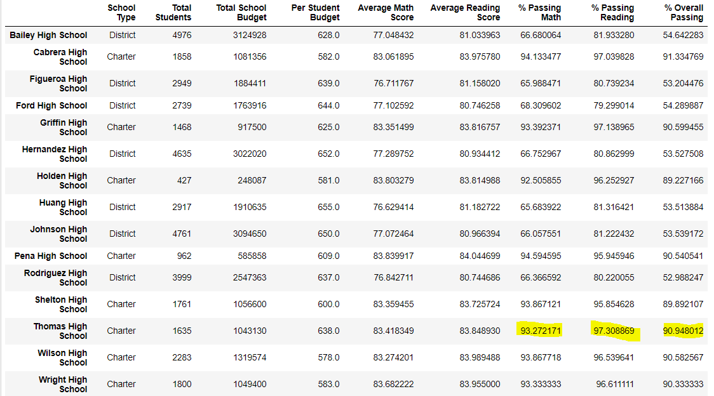
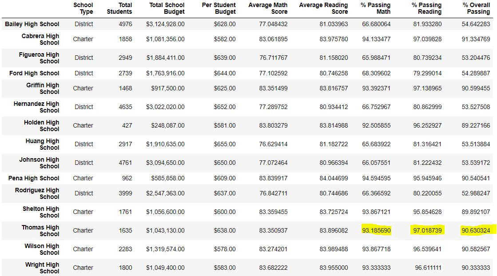

(For Reference, The upper table displays our data, pre-adjustment, while the lower table displays our data post-adjustment)
### Effects on Overall Performance
Looking at this change of data, pre and post adjustment, we can see that Thomas High School still remains the second top-performing school within the district, despite the academic dishonesty of the ninth graders.

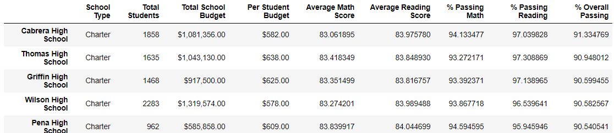
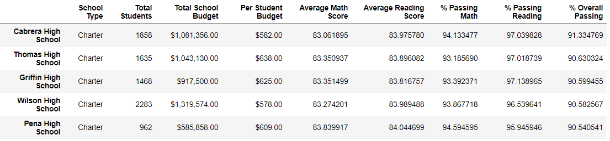

(For Reference, The upper table displays our data, pre-adjustment, while the lower table displays our data post-adjustment)

These changes in our data are quite minute, comparing pre and post data adjustment, and does not change their standing amongst other schools within the district.
### Effects on Scores
#### Scores by Grade
With the exception of ommiting the ninth grade from Thomas High School, there are no changes, as seen in the tables below:

Math

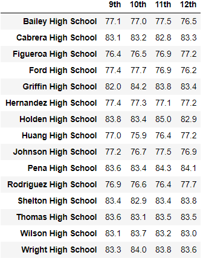
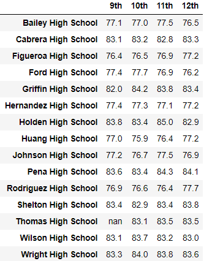

(For Reference, The left table displays our data, pre-adjustment, while the right table displays our data post-adjustment)

Reading

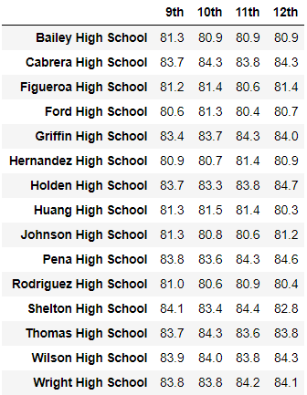
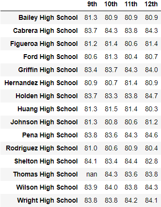

(For Reference, The left table displays our data, pre-adjustment, while the right table displays our data post-adjustment)

#### Scores by School Spending
Ommiting the ninth grade of Thomas High School had no visible effect on overal grades based on school spending, as seen in the tables below:

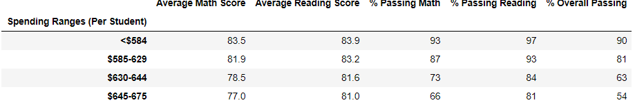
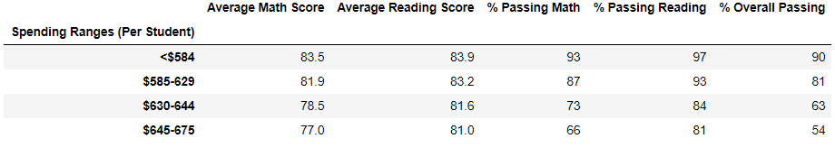

(For Reference, The upper table displays our data, pre-adjustment, while the lower table displays our data post-adjustment)
#### Scores by School Size
Ommiting the ninth grade of Thomas High School had no visible effect on overal grades based on school size, as seen in the tables below:

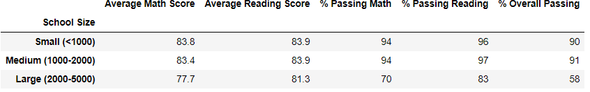
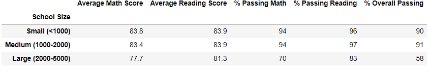

(For Reference, The upper table displays our data, pre-adjustment, while the lower table displays our data post-adjustment)
#### Scores by School Type
Ommiting the ninth grade of Thomas High School had no visible effect on overal grades based on school type, as seen in the tables below:

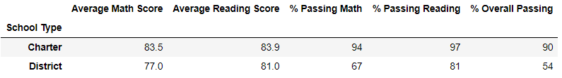
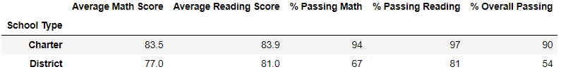

(For Reference, The upper table displays our data, pre-adjustment, while the lower table displays our data post-adjustment)
### Summary
The Academic Dishonesty within Thomas High School, being one the of the top performing schools, was enough to cause change to the overal district itself and to state-standard test results from it. At the district level, it single handedly lowered the percentage of students passing math by 0.2%, reading by 0.1% and overall passing student percentages by 3%. Look at the school directly, we can see that the percentage of passing students overall from Thomas High School was lowered by 0.318% after ommiting the ninth grade for academic dishonesty.
